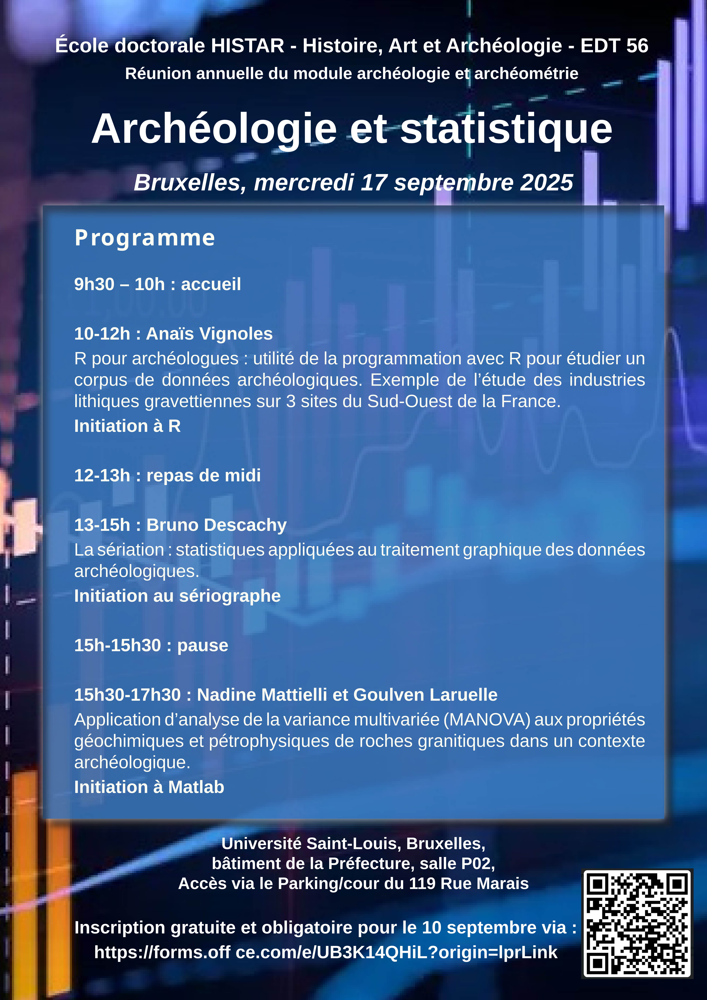
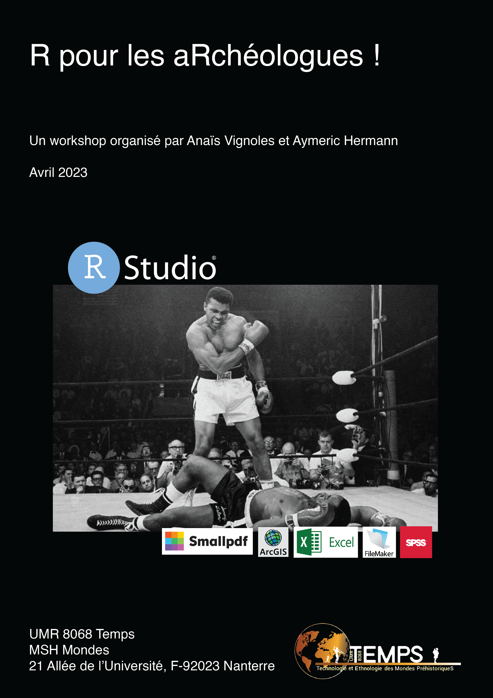

#  R pour les aRchéologues

Ce dépôt est un recueil de matériel pédagogique à destination d'archéologues souhaitant se familiariser avec R. 

## Ressources diverses 
Le dossier [cheatsheets](cheatsheets) contient divers documents avec des listes de fonctions ou grammaires pour R. Il s'agit de sortes d'aides mémoires.  

Le dossier [data](data) contient des données permettant de faire les TPs.   

Vous trouverez [ici](ressources-en-ligne.html) un recensement de ressources en ligne pour aller plus loin. Des entrepôts de données sont également listés.  

## Réunion annuelle du module archéologie et archéométrie de l'EDT 56 (Bruxelles, le 17 septembre 2025)
Le dossier [ED4-Bruxelles-2025](ED4-Bruxelles-2025) contient la présentation ainsi que le TP proposé aux doctorant.e.s lors de la réunion annuelle du module archéologie et archéométrie de l'École doctorale HISTAR - Histoire, Art et Archéologie, dispensé à Bruxelles le 17 septembre 2025. La séance a duré 1h30. 

- [Présentation](ED4-Bruxelles-2025/presentation.pdf)
- [TP](ED4-Bruxelles-2025/TP-ED4.html)  

## Workshop à destination des doctorant.e.s et chercheur.euse.s de l'UMR 8068 TEMPS (Nanterre, 2023)
Le dossier [workshop-TEMPS-2023](workshop-TEMPS-2023) contient les tutoriels, scripts et données nécessaires pour suivre le workshop "R pour les aRchéologues" organisé par A. Vignoles et A. Hermann au sein de l'UMR 8068 TEMPS en 2023. La formation s'est composée de 4 séances de 2h. 

- [Débuter avec R et RStudio](workshop-TEMPS-2023/debuter_avec_R.html)  
- [seance 0 : Pré-requis](workshop-TEMPS-2023/seance-0_pre-requis.html)
- [Séance 1 : Se familiariser avec R](workshop-TEMPS-2023/seance-1.html)
- [Séance 2 : Créer des graphiques avec base R et ggplot](workshop-TEMPS-2023/seance-2.html)
- [Séance 3 : Sous-ensembles et visualisation avec tidyverse](workshop-TEMPS-2023/seance-3.html)
- [Séance 4 : Boucles de programmation](workshop-TEMPS-2023/seance-4.html)
- [Séance Bonus : Trucs et astuces au quotidien](workshop-TEMPS-2023/seance-astuces.html)
- [TP 1-2 : exercices autour d'un jeu de données](workshop-TEMPS-2023/TP-1-2.html)

## License
[CC BY-NC 4.0](https://creativecommons.org/licenses/by-nc/4.0/)
