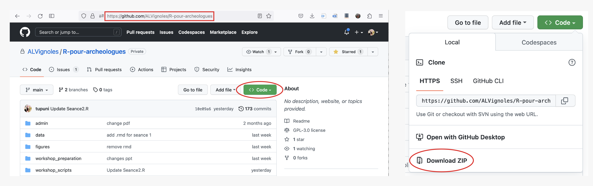

# Récupérer les documents nécessaires sur github
Rendez-vous sur le dépôt [https://github.com/ALVignoles/R-pour-archeologues](https://github.com/ALVignoles/R-pour-archeologues) et téléchargez l'ensemble au format zip.  

# Installer R et RStudio
[R pour Mac](https://external.ink?to=/cran.r-project.org/bin/macosx/) ou [R pour Windows](https://external.ink?to=/cran.r-project.org/bin/windows/base/) ou [R pour Linux](https://external.ink?to=/cran.r-project.org/bin/linux/)  

[RStudio](https://external.ink?to=/rstudio.com/products/rstudio/download/).  

RStudio est constitué de 4 panneaux:  
- en haut à gauche: **l'éditeur** où est édité le code enregistré dans fichiers.  
- en bas à gauche: **la console** où sont executées les lignes de code, directement ou à partir du fichier source ouvert dans l'éditeur.  
- en haut à droite: **l'environnement** où apparaissent les objets R que chargés ou créés.  
- en bas à droite: **l'espace de visualisation** utilisé pour naviguer dans les dossiers, visualiser les plots créés, afficher l'aide, etc.  

  

# Répertoire de travail
Pour pouvoir récupérer des données, maîtriser la sauvegarde des scripts, des résultats, etc. il est important d'indiquer au logiciel le répertoire de travail, c’est-à-dire le répertoire à partir duquel les jeux de données seront chargés, et où les résultats de nos productions seront sauvegardés.  

Trois moyens de préciser le répertoire de travail:  
1- Avec la commande `setwd()`. La commande `getwd()` permet de savoir dans quel répertoire vous vous trouvez. Notez que R ne reconnaît que le caractère “/” pour spécifier le chemin d’accès d’un répertoire.  
2- On peut aussi passer la commande en pointer-cliquer dans la barre d'outil en haut de la fenêtre avec  
*Session -> Set Working Directory -> Choose Directory*.  
3- En ouvrant RStudio à partir d'un fichier .Rproj, en l'occurrence `R-pour-archeologues.Rproj`. Ce fichier permettra d'indiquer à R que l'on travaille par défaut dans le dossier où est stocké ce fichier, et pour reprendre le travail entre deux sessions, puisque le projet R garde en mémoire l'état dans lequel RStudio a été laissé lors de la dernière session. Puisque l'arborescence et le contenu de chaque machine dépend de l'utilisateur-trice, l'utilisation du projets R est très utile pour la reproductibilité, pour fournir un environnement commun à tou-te-s les utilisateurs.  

**En principe vous êtes prêts pour le workshop :-)**
