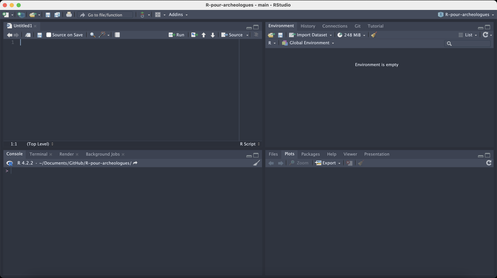

# - R et RStudio
Installation de :\
[R pour Mac](https://external.ink?to=/cran.r-project.org/bin/macosx/) ou\
[R pour Windows](https://external.ink?to=/cran.r-project.org/bin/windows/base/) ou \
[R pour Linux](https://external.ink?to=/cran.r-project.org/bin/linux/).\
\
et de :\
[RStudio](https://external.ink?to=/rstudio.com/products/rstudio/download/).\
ou \
utiliser [la version en ligne de R Studio à partir d'Huma-num](https://humanum.hypotheses.org/3088).\
\
\
*Aparté sur les problèmes d'équipement:*
*Sur les machines les plus anciennes il se peut que l'installation de R Studio soit difficile.*
*Une solution est d'utiliser l'application en ligne R Studio d'Huma-num.*
*Pour cela il vous faut en amont contacter assistance@huma-num.fr et cogrid@huma-num.fr pour demander l'accès à https://r-tools.huma-num.fr/ en leur communiquant les éléments suivants:*\
*- Nom, Prénom*\
*- Laboratoire / établissement de rattachement*\
*- Email*\
*- Statut (i.e doctorat, enseignant-chercheur, chercheur, ITA, IATOS)*\
*- Cadre/s d’utilisation (programme de recherche, recherche dans le cadre d’une thèse)*\
*- Description courte (< 5 lignes) du/des cadres/s d’utilisation*\
*- Affection d’une instance de GPU : NON*\
*- Pour les étudiants en thèse : sujet, directeur de thèse, date de soutenance prévue.*\
*- Pour les étudiants, stagiaires, CDD : date de fin d’utilisation*\
*- Volumétrie des fichiers en GO : disons 2*\
*Cela vous permettra d'ouvrir une session R Studio dans votre navigateur:*\
*URL de connexion : https://r-tools.huma-num.fr/*\
*avec le login et mot de passe du compte SSH qui vous aura été communiqué par sysadmin@huma-num.fr.*\
⚠️ **ATTENTION: Comptez 2 à 3 jours pour obtenir vos identifiants et mot de passe de connexion**
\
\
\
RStudio est constitué de 4 panneaux:  
- en haut à gauche: **l'éditeur** où est édité le code enregistré dans fichiers.  
- en bas à gauche: **la console** où sont executées les lignes de code, directement ou à partir du fichier source ouvert dans l'éditeur.  
- en haut à droite: **l'environnement** où apparaissent les objets R que chargés ou créés.  
- en bas à droite: **l'espace de visualisation** utilisé pour naviguer dans les dossiers, visualiser les plots créés, afficher l'aide, etc.  

  

# - Récupérer les documents nécessaires sur GitHub
Rendez-vous sur le dépôt [https://github.com/ALVignoles/R-pour-archeologues](https://github.com/ALVignoles/R-pour-archeologues) et téléchargez l'ensemble au format zip.  

# - Répertoire de travail
Pour pouvoir récupérer des données, maîtriser la sauvegarde des scripts, des résultats, etc. il est important d'indiquer au logiciel le répertoire de travail, c’est-à-dire le répertoire à partir duquel les jeux de données seront chargés, et où les résultats de nos productions seront sauvegardés.  

Trois moyens de préciser le répertoire de travail:  
1- Avec la commande `setwd()`. La commande `getwd()` permet de savoir dans quel répertoire vous vous trouvez. Notez que R ne reconnaît que le caractère “/” pour spécifier le chemin d’accès d’un répertoire.  
2- On peut aussi passer la commande en pointer-cliquer dans la barre d'outil en haut de la fenêtre avec  
*Session -> Set Working Directory -> Choose Directory*.  
3- En ouvrant une session RStudio à partir d'un fichier .Rproj, en l'occurrence `R-pour-archeologues.Rproj`. Ce fichier permettra d'indiquer à R que l'on travaille par défaut dans le dossier où est stocké ce fichier, et pour reprendre le travail entre deux sessions, puisque le projet R garde en mémoire l'état dans lequel RStudio a été laissé lors de la dernière session. Puisque l'arborescence et le contenu de chaque machine dépend de l'utilisateur-trice, l'utilisation du projets R est très utile pour la reproductibilité, pour fournir un environnement commun à tou-te-s les utilisateurs.  
4- Si vous utilisez l'IDE RStudio sur le serveur d'Huma-num (https://r-tools.huma-num.fr/), la procédure est la suivante:
- Sur votre machine, créer un fichier .zip 'R-pour-archeologues.zip' à partir du dossier 'R-pour-archeologues'
téléchargé depuis GitHub.
- Dans l'onglet 'Files' du panneau 'Visualisation' (dans le coin bas-droit de la fenêtre Rstudio), ajouter l'ensemble du dossier avec le bouton 'Upload'.
- Avec la commande suivante, indiquer que ce dossier est le répertoire de travail: `setwd("~/R-pour-archeologues")`

**Vous êtes prêt-e-s pour le workshop :-)**
